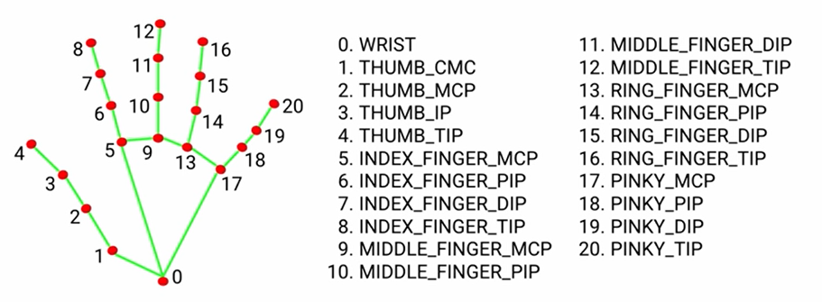
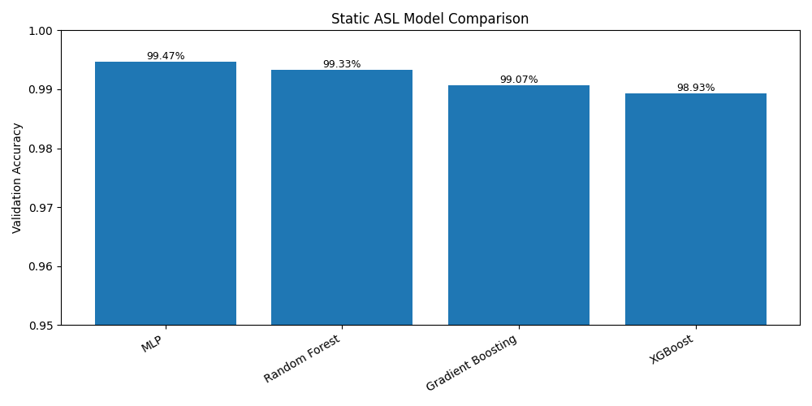
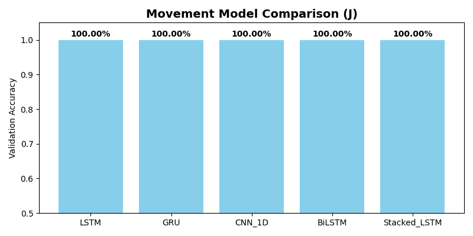
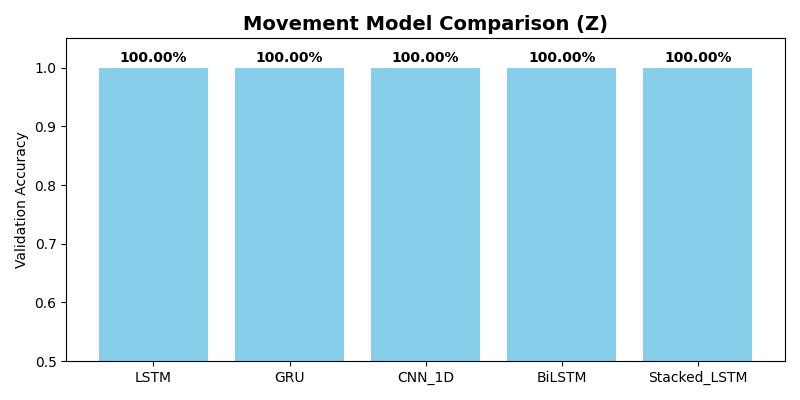
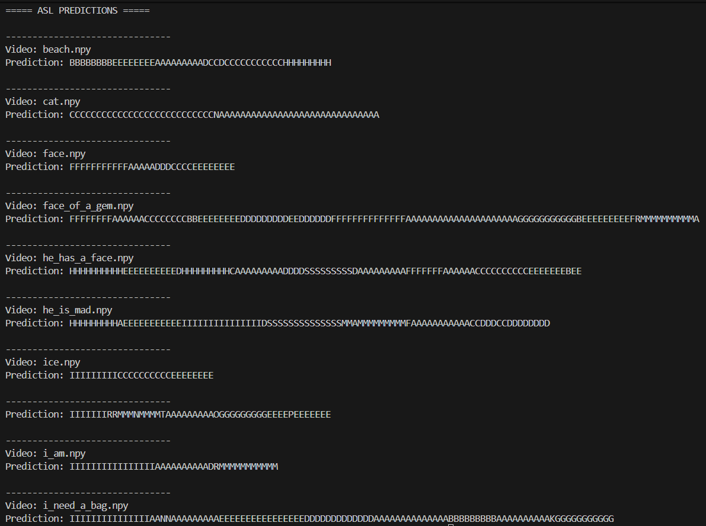

# ASL Hand Tracking Translator


_Created by **Réka Gábosi**_


## Table of Contents

- [Description](#description)
  - [Hand Landmark Representation](#hand-landmark-representation)
- [File Structure](#file-structure)
- [Dataset](#dataset)
  - [Dataset Types](#dataset-types)
  - [Dataset Size](#dataset-size)
- [Data Processing](#data-processing)
  - [Static letters (A-I, K-Y)](#static-letters-a-i-k-y)
  - [Movement Letters (J and Z)](#movement-letters-j-and-z)
- [Model Selection and Training (Static Letters)](#model-selection-and-training-static-letters)
  - [Models evaluated](#models-evaluated)
  - [Validation Results](#validation-results)
  - [Best Performing Model](#best-performing-model)
- [Model Selection and Training (Movement Letters)](#model-selection-and-training-movement-letters)
  - [Models evaluated](#models-evaluated-1)
  - [Validation Results](#validation-results-1)
  - [Best Performing Models](#best-performing-models)
- [Recorded Video Inference (ASL Sentences)](#recorded-video-inference-asl-sentences)
  - [Video Recording & Landmark Extraction](#video-recording--landmark-extraction)
  - [Observations & Challenges](#observations--challenges)
  - [Mitigation Attempts](#mitigation-attempts)
  - [Example Model Predictions](#example-model-predictions)
- [NLP & LLM Post-Processing (Experimental Stage)](#nlp--llm-post-processing-experimental-stage)
  - [Example: Raw vs Collapsed vs NLP vs LLM](#example-raw-vs-collapsed-vs-nlp-vs-llm)
  - [What This Shows](#what-this-shows)
  - [Why NLP & LLM Alone Weren’t Enough (For Now)](#why-nlp--llm-alone-werent-enough-for-now)
  - [Current Conclusion](#current-conclusion)
  - [Future Directions (When Returning To The Project)](#future-directions-when-returning-to-the-project)


## Description

A computer vision and machine learning project that recognizes American Sign Language (ASL) letters
using real-time hand landmark tracking and custom-trained models.

### Hand Landmark Representation

The project uses **MediaPipe Hand Tracking**, which represents each hand using
**21 key landmarks**, each with `(x, y, z)` coordinates.




## File Structure

```bash
asl-hand-tracking-translator/
│
├── data/                                # All dataset-related files
│   ├── movement_sequences/              # Dynamic ASL letters (J and Z)
│   │   ├── J/                           # Sequences for letter J
│   │   │   ├── J_0.npy                  # One full movement sequence
│   │   │   └── ...
│   │   └── Z/                           # Sequences for letter Z
│   │       ├── Z_0.npy                  # One full movement sequence
│   │       └── ...
│   │
│   ├── processed/                       # Preprocessed and ready-to-use datasets
│   │   ├── movement_J_X_train.npy       # Training features for J
│   │   ├── movement_J_y_train.npy       # Training labels for J
│   │   ├── movement_J_X_val.npy         # Validation features for J
│   │   ├── movement_J_y_val.npy         # Validation labels for J
│   │   ├── movement_J_X_test.npy        # Test features for J
│   │   ├── movement_J_y_test.npy        # Test labels for J
│   │   ├── movement_Z_X_train.npy       # Training features for Z
│   │   ├── movement_Z_y_train.npy       # Training labels for Z
│   │   ├── movement_Z_X_val.npy         # Validation features for Z
│   │   ├── movement_Z_y_val.npy         # Validation labels for Z
│   │   ├── movement_Z_X_test.npy        # Test features for Z
│   │   ├── movement_Z_y_test.npy        # Test labels for Z
│   │   ├── static_X_train.npy           # Training features for static letters
│   │   ├── static_y_train.npy           # Training labels for static letters
│   │   ├── static_X_val.npy             # Validation features for static letters
│   │   ├── static_y_val.npy             # Validation labels for static letters
│   │   ├── static_X_test.npy            # Test features for static letters
│   │   └── static_y_test.npy            # Test labels for static letters
│   │
│   ├── raw_landmarks/                   # Original hand landmark samples
│   │   ├── A/                           # Folder for letter A
│   │   ├── B/                           # Folder for letter B
│   │   ├── C/                           # Folder for letter C
│   │   └── ... (other letters)          
│   │
│   ├── raw_videos/                      # Recorded test videos
│   │   ├── beach.mp4
│   │   ├── cat.mp4
│   │   └── ...
│   │
│   └── video_landmarks/                 # Landmarks extracted from test videos
│       ├── beach.npy
│       ├── cat.npy
│       └── ...
│
├── images/                              # Reference images & model visualizations
│   ├── Hands_Landmarks.png              # Hand landmark illustration
│   ├── choose_movement_model_j.png      # Movement model comparison for J
│   ├── choose_movement_model_z.png      # Movement model comparison for Z
│   ├── choose_static_model.png          # Static model comparison
│   └── the_model_letter_prediction.png  # Example of model predictions
│
├── models/                              # Saved trained models
│   ├── movement_J_best_LSTM.keras       # Best model for letter J
│   ├── movement_Z_best_LSTM.keras       # Best model for letter Z
│   └── static_best_model_MLP.joblib     # Best static letter model
│
├── src/                                 # Source code
│   ├── asl_llm_processing.py            # LLM reconstruction / text correction
│   ├── asl_nlp_processing.py            # Rule-based NLP processing for letters
│   ├── choose_movement_model.py         # Train & compare movement letter models
│   ├── choose_static_model.py           # Train & compare static letter models
│   ├── data_collection.py               # Collect static letter samples
│   ├── data_processing.py               # Clean, normalize & split datasets
│   ├── hand_detector.py                 # MediaPipe hand detection & landmark extraction
│   ├── run_asl_models_on_videos.py      # Run trained models on recorded video landmarks
│   ├── video_recorder_and_extract_handlandmark.py # Record videos & extract landmarks
│   └── movement_data_collection.py      # Collect J and Z movement sequences
│
├── test/                                # Testing utilities
│   ├── test_data/                       # Small dataset for tests
│   │   └── A/
│   │       ├── A_0.npy
│   │       └── ...
│   └── test_data_collection.py          # Test data collection logic
│
├── IMPLEMENTATION_LOG.md                # Development history & progress
├── LICENSE CC BY-ND 4.0                 # Project license
├── README.md                            # Project overview
└── requirements.txt                     # Python dependencies
```


## Dataset

The dataset used in this project was **collected manually** using a webcam and **MediaPipe hand tracking**.

Each sample consists of:
- **21 hand landmarks**
- **3 coordinates per landmark** (`x`, `y`, `z`)

### Dataset Types

- **Static dataset**  
  Single-frame landmark samples representing static ASL letters.

- **Movement dataset**  
  Multi-frame landmark sequences representing dynamic ASL letters (**J** and **Z**).

This approach avoids using pre-built datasets and ensures full control over
data quality, consistency, and preprocessing.

### Dataset Size

The dataset contains **approximately 250 samples per ASL letter**, including both
static and movement-based letters.

- **Static letters (A–I, K–Y):**
  - ~250 single-frame landmark samples per letter

- **Movement letters (J, Z):**
  - ~250 movement sequences per letter  
  - J sequences contain 40 frames each  
  - Z sequences contain 60 frames each  

> **Note:**  
> For movement-based letters, a larger number of samples would typically improve
> model robustness due to higher variability in motion.  
> However, for this portfolio project, the dataset was intentionally kept consistent
> at ~250 samples per letter to evaluate how well the model performs under limited
> movement data conditions.


## Data Processing

### Static letters (A-I, K-Y)

Static ASL letters are represented as **single-frame hand poses**.

**Processing steps:**
- Load raw `.npy` landmark files (63 values per sample).
- Normalize landmarks:
  - Wrist is used as the origin.
  - All landmarks are scaled by maximum distance from the wrist.
- Filter out invalid or corrupted samples.
- Encode letter labels as integers.
- Split data into:
  - Training set (70%)
  - Validation set (15%)
  - Test set (15%)
- Save processed datasets into the `data/processed/` folder.

**Output files:**
- `static_X_train.npy`
- `static_y_train.npy`
- `static_X_val.npy`
- `static_y_val.npy`
- `static_X_test.npy`
- `static_y_test.npy`

### Movement Letters (J and Z)

ASL letters **J** and **Z** involve motion and are handled separately from static letters.

Each movement sample is stored as a **sequence of frames**:
- J → 40 frames per sequence
- Z → 60 frames per sequence

**Processing steps:**
- Load full movement sequences from disk.
- Validate sequence length and feature shape.
- Normalize each frame individually using the same wrist-based method.
- Keep J and Z as **separate datasets** due to different sequence lengths.
- Split each letter into training, validation, and test sets.
- Save processed movement datasets separately.

**Output files:**
- `movement_J_X_train.npy`
- `movement_J_y_train.npy`
- `movement_J_X_val.npy`
- `movement_J_y_val.npy`
- `movement_J_X_test.npy`
- `movement_J_y_test.npy`

- `movement_Z_X_train.npy`
- `movement_Z_y_train.npy`
- `movement_Z_X_val.npy`
- `movement_Z_y_val.npy`
- `movement_Z_X_test.npy`
- `movement_Z_y_test.npy`


## Model Selection and Training (Static Letters)

To identify the most suitable model for recognizing **static ASL letters**, multiple
machine learning classifiers were trained and evaluated using the same processed dataset.

All models were trained on the **training set** and evaluated on the **validation set**
to ensure a fair comparison.

### Models evaluated
- Multi-Layer Perceptron (MLP)
- Random Forest
- Gradient Boosting
- XGBoost

### Validation Results

| Model               | Validation Accuracy |
|--------------------|---------------------|
| MLP                | **99.47%**          |
| Random Forest      | 99.33%              |
| Gradient Boosting  | 99.07%              |
| XGBoost            | 98.93%              |

The following figure shows a visual comparison of validation accuracy across models:



### Best Performing Model

Based on validation accuracy, the **MLP classifier** achieved the best performance
and was selected as the final static-letter recognition model.

**Selected model:**
- **Model:** Multi-Layer Perceptron (MLP)
- **Validation accuracy:** **99.47%**

The best-performing model was saved for later use in real-time inference and integration
with movement-based models and NLP post-processing.


## Model Selection and Training (Movement Letters)

To recognize **movement-based ASL letters** (**J** and **Z**), sequence models were tested.

### Models evaluated
- LSTM
- GRU
- 1D CNN
- Bidirectional LSTM (BiLSTM)
- Stacked LSTM

### Validation Results

#### Letter J

| Model         | Validation Accuracy |
|---------------|-------------------|
| LSTM          | **100.00%**       |
| GRU           | 100.00%           |
| CNN_1D        | 100.00%           |
| BiLSTM        | 100.00%           |
| Stacked_LSTM  | 100.00%           |



#### Letter Z

| Model         | Validation Accuracy |
|---------------|-------------------|
| LSTM          | **100.00%**       |
| GRU           | 100.00%           |
| CNN_1D        | 100.00%           |
| BiLSTM        | 100.00%           |
| Stacked_LSTM  | 100.00%           |



**Best Performing Models:**
- **Letter J:** LSTM, Validation Accuracy = 100.00%
- **Letter Z:** LSTM, Validation Accuracy = 100.00%
- Saved for later integration with static-letter model and real-time inference.


## Recorded Video Inference (ASL Sentences)

To evaluate how the trained models perform beyond the training setup,
a recorded video inference pipeline was implemented.

In this step, videos were **recorded first**, hand landmarks were
**extracted immediately during recording**, and **predictions were run afterward**
(not in real time).

This separation made debugging and evaluation easier while keeping
the data collection process consistent.

### Video Recording & Landmark Extraction

- Test videos were recorded using a webcam.
- Each frame was processed with **MediaPipe Hand Tracking**.
- Hand landmarks were extracted per frame and saved as `.npy` files.
- The corresponding raw videos were saved as `.mp4` files.

Both the raw video and landmark data are stored for reproducibility
and offline evaluation.

### Observations & Challenges

During testing, several limitations became apparent:

- Some ASL letters were consistently misclassified.
- The model was trained using data recorded:
  - In a different physical location
  - With different lighting conditions
  - With a different camera angle

These differences introduced a **domain shift**, which negatively affected
prediction accuracy.

Additionally, although each letter contains approximately **250 samples**,
this amount is relatively small for handling real-world variability,
especially when environmental conditions change.

### Mitigation Attempts

To better isolate the source of the issue, several mitigation strategies were tested:

- Movement-based letters (**J** and **Z**) were temporarily disabled
  to focus exclusively on static hand shapes.
- The **second-best static model** was tested instead of the top-performing MLP.

**Result:**
- The second-best model did not improve predictions.
- In several cases, performance was worse.

This confirms that the primary limitation is **data diversity and coverage**,
rather than model selection.

### Example Model Predictions

The following image shows raw letter predictions produced by the model
for several recorded ASL sentence videos:



These examples demonstrate that while certain letters and short words
are recognized reliably, others require:
- More training samples
- Greater variation in lighting, camera angle, and hand positioning


## NLP & LLM Post-Processing (Experimental Stage)

After predicting ASL letters from video, two post-processing approaches were tested to convert the raw output into readable words:

- **NLP rule-based greedy word parsing**
- **LLM reconstruction using `google/flan-t5-base`**

Both systems operated on the same input pipeline:

```bash
ASL output → repeated letters collapsed → attempt to form English words/sentences
```

#### Example: Raw vs Collapsed vs NLP vs LLM

| Video | Collapsed Letters | NLP Greedy Split | LLM Output |
|-------|------------------|-----------------|------------|
| beach.npy | BEACH | Beach | BEACH |
| cat.npy | CA | C a | CA |
| face.npy | FADCE | Fad c e | FADCE |
| face_of_a_gem.npy | FACEDDFAGEM | Faced d fag e m | FACEDDFAGEM |
| he_has_a_face.npy | HEHADSAFACE | He had s a face | HEHADSAFACE |
| he_is_mad.npy | HEISMADD | He ism add | HEIMADD |
| ice.npy | ICE | Ice | ICE |
| image.npy | IMMAGEE | I m mage e | IMMAGEE |
| i_am.npy | IAM | I am | AM |
| i_need_a_bag.npy | IAEDABAG | I a e dab a g | IAEDAG |

### What This Shows

✔ The collapsing step worked  
✔ Some short words were detected  
❌ Neither system reliably converted the output into full sentences  
❌ Partial words, missing letters, and domain shift still break both systems  

In other words:

> The bottleneck is not the language models — it’s the quality and stability of the letter predictions they receive.  
> Because the inputs are inconsistent, even an LLM cannot reliably guess the missing structure.

### Why NLP & LLM Alone Weren’t Enough (For Now)

| Problem | Why it Happens |
|---------|----------------|
| Letters collapse incorrectly | Model confidence fluctuates between frames |
| Words break apart | Domain shift: lighting, camera, angle differences |
| LLM can’t “guess” context | Too little information / missing letters |
| Examples: “He” → “H e”, “Need” → “e d” | Unstable per-frame predictions cascade into bad sequences |

> Even advanced models will fail if the upstream signal is unstable.  
> This isn’t a programming issue — it’s a data pipeline stability issue.

### Current Conclusion 

This project is **functionally complete** in its current form:

- Hand tracking works  
- Some ASL letters can be predicted from video  
- Collapsed sequences can be parsed  
- NLP and LLM post-processing partially help but do not fix messy inputs  

At this stage, the best conclusion is:

> The project successfully demonstrates a full ASL → Landmark → Letter → Word pipeline,  
> but reliable sentence reconstruction requires better data quality, not just a smarter model.

### Future Directions (When Returning To The Project)

When continuing development, the most promising next upgrades are:

1️⃣ **Improve Letter Consistency**
- Capture more samples per letter  
- Multiple lighting/camera environments (reduce domain shift)  
- Add noise-augmented training data  

2️⃣ **Temporal Models for Sentence Stability**
- LSTM / Transformer over time instead of frame-by-frame letters  
- Predict letters from sequences, not snapshots  

3️⃣ **Lexicon-Constrained Decoding**
- Only allow valid English letter combinations  
- Beam search over word probability  

4️⃣ **Fine-Tune a Small LLM**
- Train on your own collapsed → corrected examples to teach it the pattern
